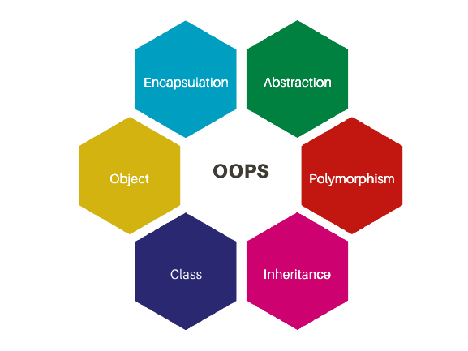

# Features of Java
<br>


1. **Simple**
2. **Object-Oriented**
3. **Platform Independent**
4. **Secured**
5. **Robust**
6. **Architecture Neutral**
7. **Portable**
8. **High Performance**
9. **Distributed**
10. **Multithreaded**
11. **Dynamic**


Java is renowned for its robustness, security, and versatility. Below are the key features that contribute to Java's popularity and effectiveness:

## 1. Simple

Java's simplicity lies in its clean syntax and straightforward design, making it accessible to beginners and experienced developers alike.

### Explanation:
- **Easy to Learn:** Java's syntax is based on C++, which is widely understood, easing the learning curve for programmers transitioning to Java.
- **Minimal Complexity:** Java omits complex features like explicit pointers and operator overloading, prioritizing simplicity and readability.
- **Automatic Garbage Collection:** Java's automatic memory management feature eliminates the need for manual memory deallocation, simplifying memory management for developers.

### Example:
```java
public class HelloWorld {
    public static void main(String[] args) {
        System.out.println("Hello, World!");
    }
}
```

## 2. Object-Oriented

Java embraces the object-oriented programming paradigm, enabling developers to build modular, reusable, and maintainable code.

### Explanation:
- **Everything is an Object:** In Java, everything is treated as an object, encapsulating both data and behavior within classes.
- **Key Concepts:** Java supports fundamental OOP principles such as inheritance, polymorphism, and encapsulation, facilitating code organization and abstraction.
<br>



### Example:
```java
class Animal {
    void sound() {
        System.out.println("Animal makes a sound");
    }
}

class Dog extends Animal {
    void sound() {
        System.out.println("Dog barks");
    }
}
```

## 3. Platform Independent

Java's platform independence allows developers to write code once and run it on any platform with a compatible Java Virtual Machine (JVM).

### Explanation:
- **Write Once, Run Anywhere (WORA):** Java bytecode can execute on any platform with a JVM, eliminating the need for platform-specific implementations.
- **Software-Based Platform:** Java's platform is software-based, running atop hardware platforms, ensuring consistency across different environments.
<br>


### Example:
```java
public class HelloWorld {
    public static void main(String[] args) {
        System.out.println("Hello, World!");
    }
}
```

## 4. Secured

Java's robust security features protect against unauthorized access and ensure the integrity of applications.

### Explanation:
- **Sandbox Environment:** Java programs run within a secure sandbox environment, preventing access to system resources.
- **Security Features:** Java incorporates mechanisms like classloaders, bytecode verifier, and security manager to enforce security policies.

### Example:
```java
import java.security.MessageDigest;

public class HashExample {
    public static void main(String[] args) {
        try {
            MessageDigest md = MessageDigest.getInstance("SHA-256");
            String text = "Hello, Java!";
            md.update(text.getBytes());
            byte[] digest = md.digest();
            System.out.println("Hash: " + bytesToHex(digest));
        } catch (Exception e) {
            System.out.println("Error: " + e.getMessage());
        }
    }

    private static String bytesToHex(byte[] bytes) {
        StringBuilder result = new StringBuilder();
        for (byte b : bytes) {
            result.append(String.format("%02x", b));
        }
        return result.toString();
    }
}
```

## 5. Robust

Java's robustness stems from its strong memory management, exception handling, and type checking mechanisms.

### Explanation:
- **Strong Memory Management:** Java employs automatic garbage collection to reclaim memory, preventing memory leaks and corruption.
- **Exception Handling:** Java's robust exception handling mechanisms ensure graceful error recovery and program stability.

### Example:
```java
public class DivisionExample {
    public static void main(String[] args) {
        int dividend = 10;
        int divisor = 0;
        try {
            int result = dividend / divisor;
            System.out.println("Result: " + result);
        } catch (ArithmeticException e) {
            System.out.println("Error: Division by zero");
        }
    }
}
```

## 6. Architecture Neutral

### Java: Architecture Neutrality

Java is celebrated for its architecture neutrality, a characteristic that enables developers to write code once and run it on any platform with a compatible Java Virtual Machine (JVM). Let's delve into why Java is regarded as architecture-neutral:

## Bytecode

When you compile a Java program, it isn't translated directly into machine code specific to a particular architecture. Instead, it's compiled into bytecode. Bytecode is a platform-independent binary format that serves as an intermediate representation of the source code. It's designed to be executed by the Java Virtual Machine (JVM) regardless of the underlying hardware architecture.

## Java Virtual Machine (JVM)

The JVM plays a pivotal role in Java's architecture neutrality. It abstracts away the intricacies of the underlying hardware architecture by providing a uniform runtime environment. Each platform and operating system has its own implementation of the JVM, customized to cater to the specific characteristics of that environment. The JVM interprets and executes Java bytecode, translating it into machine code that's understandable by the underlying hardware. This abstraction shields Java programs from the nuances of different architectures, allowing them to run seamlessly across diverse platforms.

## Fixed-size Primitive Types

Java defines fixed-size primitive data types (e.g., `int`, `float`, `double`) with specific sizes, irrespective of the underlying hardware architecture. For instance, an `int` in Java is always 32 bits, regardless of whether the program is running on a 32-bit or 64-bit architecture. This consistency ensures predictable behavior across different platforms, contributing to Java's architecture neutrality.

Java's reliance on bytecode and the JVM, coupled with its consistent treatment of primitive types, empowers it to transcend architectural disparities. As a result, Java programs can be developed and deployed across various platforms without necessitating modifications, underscoring its architecture neutrality.

Java's architecture neutrality ensures consistent behavior across different architectures and platforms.

### Explanation:
- **Implementation Independence:** Java's primitive types have fixed sizes, guaranteeing consistency across different architectures and platforms.

## 7. Portable

Java's portability allows developers to write code once and execute it on any platform with a compatible JVM.

### Explanation:
- **Bytecode Portability:** Java bytecode can be executed on any platform with a compatible JVM, facilitating seamless deployment across different environments.

## 8. High Performance

Java offers high performance through optimized runtime environments and close-to-native code execution.

### Explanation:
- **Close to Native Code:** Java bytecode is compiled close to native code, resulting in faster execution compared to traditional interpreted languages.

## 9. Distributed

Java's support for distributed computing enables the development of scalable and interconnected systems.

### Explanation:
- **Support for Distributed Computing:** Java provides APIs like RMI (Remote Method Invocation) and EJB (Enterprise JavaBeans) for developing distributed applications, facilitating seamless communication between networked systems.

## 10. Multithreaded

Java's multithreading capabilities enable concurrent execution, enhancing performance and responsiveness.

### Explanation:
- **Concurrent Execution:** Java supports

 multithreading, allowing programs to execute multiple tasks concurrently.

## 11. Dynamic

Java's dynamic features, such as dynamic class loading and compilation, enhance flexibility and adaptability.

### Explanation:
- **Dynamic Class Loading:** Java supports dynamic loading of classes, allowing classes to be loaded on demand at runtime.
- **Dynamic Compilation:** Java dynamically compiles and optimizes code during runtime, improving performance and flexibility.

Java's rich feature set and robustness make it a preferred choice for a wide range of applications, from enterprise systems and web development to mobile and distributed computing.


Sure, here's a detailed explanation of how Java uses both interpretation and compilation:

## 12. Understanding Java Execution: Compilation and Interpretation

Java, often termed a "compiled-interpreted" language, employs a combination of compilation and interpretation processes to execute programs. Let's delve into the intricacies of how Java utilizes these approaches:

## Compilation in Java

Java source code undergoes a compilation process, during which it's translated into an intermediate form known as bytecode. This compilation phase is reminiscent of traditional compilation processes found in languages like C and C++. The Java compiler (javac) reads the source code files (`.java` files) and translates them into bytecode instructions. Bytecode is a low-level representation of the source code, consisting of platform-independent instructions understandable by the Java Virtual Machine (JVM).

### Example:
Consider the following Java source code snippet:

```java
// Example Java Code
public class HelloWorld {
    public static void main(String[] args) {
        System.out.println("Hello, World!");
    }
}
```

After compilation using the Java compiler (`javac`), this source code would be transformed into bytecode instructions. These bytecode instructions represent the program's logic in a format that can be executed by any platform with a compatible JVM.

## Interpretation in Java

Upon execution, the JVM interprets the bytecode generated during the compilation phase. Interpretation involves translating bytecode instructions into machine code instructions that are executable by the underlying hardware. The JVM acts as an interpreter, dynamically executing the bytecode instructions and producing the desired output.

### Dynamic Translation:
As the JVM interprets bytecode, it dynamically translates bytecode instructions into machine-specific instructions during runtime. This dynamic translation ensures that Java programs can run on any platform with a compatible JVM, regardless of the underlying hardware architecture. The JVM's interpretation process facilitates Java's platform independence, allowing Java programs to be executed across diverse computing environments.

### Just-In-Time (JIT) Compilation:

To improve performance, modern JVM implementations often employ a technique called Just-In-Time (JIT) compilation. With JIT compilation, bytecode is initially interpreted, but frequently executed code segments are identified and compiled into native machine code during runtime. This native code, optimized for the specific hardware platform, is then cached and reused for subsequent executions of the same code segments. JIT compilation enhances the performance of Java programs by dynamically generating efficient native code, thereby reducing interpretation overhead.

### Example:
Consider the following Java code snippet:

```java
// Example Java Code
public class Main {
    public static void main(String[] args) {
        int a = 10;
        int b = 20;
        int sum = a + b;
        System.out.println("Sum: " + sum);
    }
}
```

During execution, the JVM may detect the frequently executed calculation of the sum and dynamically compile it into optimized native code using JIT compilation. This JIT-compiled native code improves the performance of the Java program by executing the computation more efficiently.

Java's amalgamation of compilation and interpretation, coupled with JIT compilation, enables it to achieve a delicate balance between platform independence and performance optimization. This unique approach underpins Java's versatility and widespread adoption in various computing environments.