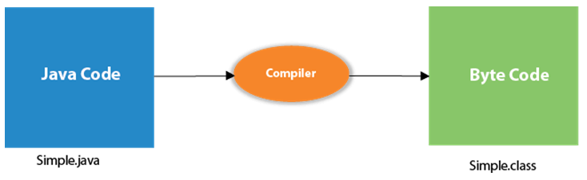
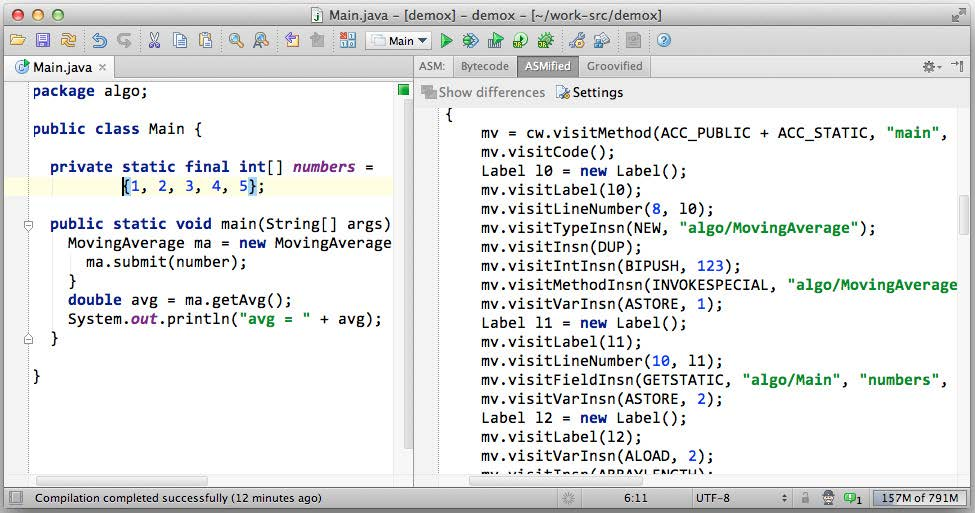

## 🚀 Internal Details of Hello Java Program

In the previous section, we have created a Java Hello World program and learned how to compile and run a Java program. In this section, we are going to learn what happens while we compile and run the Java program. Moreover, we will see some questions based on the first program.

### What happens at compile time?

At compile time, the Java file is compiled by Java Compiler (It does not interact with the OS) and converts the Java code into bytecode.

At **compile time** in Java, several crucial processes occur. Let's delve into them:

1. **Compilation Process**:
   - **Compilation** is the phase where your Java source code is transformed into **bytecode**. This bytecode is platform-independent and can be executed by the Java Virtual Machine (JVM).
   - During compilation, the Java compiler checks for **syntax errors**, **semantic correctness**, and **type compatibility**.
   - The result of compilation is a **.class** file containing the bytecode instructions for your program.

2. **Compile-Time Constants**:
   - The Java compiler **optimizes** all **compile-time constants** during compilation.
   - When you use constants (such as `final int` or `static final` variables) in your code, the compiler replaces references to these constants with their **actual values**.
   - This optimization applies to any classes where compile-time constants are used¹[3].

3. **Memory Allocation**:
   - **Compile time** itself does **not** involve memory allocation.
   - Only during **load and runtime**, memory allocation takes place.
   - Here's how it works:
     - When you run your Java program, the **classloaders** load the **.class** files into the **permanent generation (permgen)**.
     - When the **main method** is invoked, a **stack** is created, and local variables are placed there.
     - When the runtime encounters a **`new`** keyword, it creates an object on the **heap** and allocates the required memory (e.g., memory for objects like your `Test` class)²[1].

4. **Runtime Execution**:
   - **Run time** occurs when the **CPU executes** the compiled bytecode.
   - The JVM interprets the bytecode and executes the program.
   - Interpretation happens each time the program runs, allowing for greater flexibility and dynamic behavior³[5].

In summary, **compile time** focuses on generating bytecode and ensuring correctness, while **runtime** involves actual execution and memory allocation. Java's compilation process optimizes constants and prepares your code for efficient execution on the JVM.

#### Compilation of a Simple Java Program
```java
// Sample.java
public class Sample {
    public static void main(String[] args) {
        System.out.println("Hello, World!");
    }
}
```


### Bytecode in Java Programming

#### What is Bytecode?

Bytecode is an intermediate representation of a Java program that is generated by the Java compiler. It's a set of instructions understood by the Java Virtual Machine (JVM). When you compile a Java source file (.java), the compiler translates the source code into bytecode, which is stored in a .class file.

##### Characteristics of Bytecode:

1. **Platform Independence**: Bytecode is platform-independent, meaning it can be executed on any system that has a JVM installed. This makes Java a "write once, run anywhere" language.

2. **Efficiency**: Bytecode is compact and designed to be efficiently interpreted by the JVM. It strikes a balance between being human-readable and machine-efficient.

3. **Security**: Bytecode execution is controlled by the JVM, which provides security features such as sandboxing to prevent malicious code from causing harm to the system.

#### How Bytecode Works:

1. **Compilation**: When you compile a Java source file, the Java compiler generates bytecode instructions based on the source code.

2. **Bytecode Instructions**: Bytecode instructions are low-level operations that perform specific tasks, such as loading, storing, and manipulating data.

3. **Execution**: When you run a Java program, the JVM loads the bytecode instructions from the .class files and executes them one by one. It translates bytecode into machine code instructions that are understood by the underlying hardware.

##### Examples of Bytecode Instructions:

- `aload`: Load reference from local variable
- `iconst`: Push integer constant onto the stack
- `invokevirtual`: Invoke instance method on object
- `return`: Return void from method

##### Advantages of Bytecode:

1. **Portability**: Since bytecode is platform-independent, Java programs can run on any device or operating system with a JVM.

2. **Security**: Bytecode execution is controlled by the JVM, which provides a secure environment for running Java applications.

3. **Performance**: Bytecode is designed for efficient interpretation by the JVM, resulting in good performance for Java applications.



#### Conclusion:

Bytecode is a fundamental concept in Java programming, enabling platform-independent execution of Java applications. It serves as an intermediate representation of Java source code and is interpreted by the JVM to perform tasks specified by the program.

### What happens at runtime?

At runtime, the following steps are performed:

#### Java Runtime Processing

1. **Classloader**: It is the subsystem of JVM that is used to load class files.

2. **Bytecode Verifier**: Checks the code fragments for illegal code that can violate access rights to objects.

3. **Interpreter**: Reads bytecode stream then executes the instructions.


### Questions

#### Q) Can you save a Java source file by another name than the class name?

Yes, if the class is not public. It is explained in the figure given below:

##### How to Save a Simple Java Program by Another Name
```bash
# To compile
javac Hard.java
# To execute
java Simple
```
Observe that we have compiled the code with the file name but are running the program with the class name. Therefore, we can save a Java program with a name other than the class name.

#### Q) Can you have multiple classes in a Java source file?

Yes, as illustrated in the figure given below:

##### How to Contain Multiple Classes in a Simple Java Program
```java
// MultipleClasses.java
public class FirstClass {
    // Class definition
}

class SecondClass {
    // Class definition
}
```
