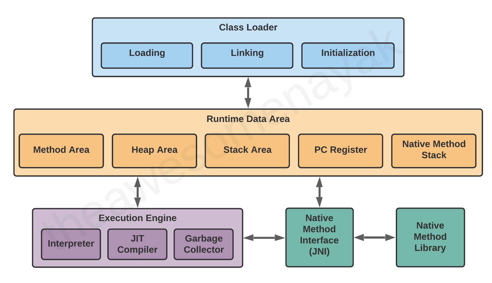
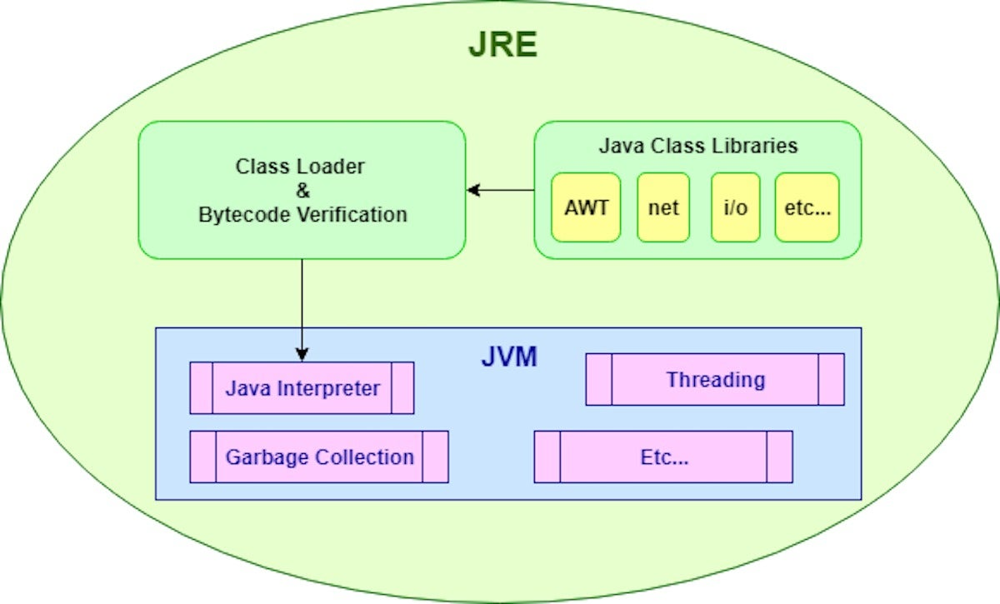
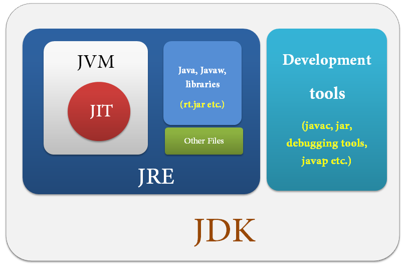

## Java Virtual Machine (JVM)

---

The Java Virtual Machine (JVM) is an essential component of the Java Runtime Environment (JRE) that executes Java bytecode. It acts as an intermediary between Java programs and the underlying hardware and operating system. Here's a breakdown of its key components and how it works:

### Components of JVM:

1. **Class Loader Subsystem:**
   - Responsible for loading class files into memory.
   - Consists of three class loaders: Bootstrap Class Loader, Extension Class Loader, and Application Class Loader.

2. **Runtime Data Area:**
   - Memory area where JVM allocates memory for execution of the program.
   - Divided into five main components:
     - Method Area
     - Heap
     - Java Stack
     - PC Registers
     - Native Method Stack

3. **Execution Engine:**
   - Executes compiled bytecode.
   - Consists of:
     - Interpreter: Interprets bytecode and executes instructions.
     - Just-In-Time (JIT) Compiler: Compiles frequently executed bytecode into native machine code for faster execution.

4. **Native Method Interface:**
   - Allows Java code to call native methods written in languages like C and C++.

5. **Java Native Interface (JNI):**
  - Provides a way for Java code to call  native libraries and vice versa.

### How JVM Works:

1. **Loading:**
   - Class loaders load bytecode from .class files into the method area.

2. **Verification:**
   - Verifies bytecode to ensure security and integrity.

3. **Execution:**
   - Interpreter reads bytecode instructions and executes them sequentially.
   - HotSpot JVM employs JIT compilation to optimize performance by compiling frequently executed bytecode into native machine code.

4. **Memory Management:**
   - Garbage Collector (GC) manages memory allocation and deallocation in the heap.
   - GC periodically identifies and removes unreferenced objects to free up memory.

5. **Native Method Invocation:**
   - Calls to native methods are handled by the Native Method Interface (JNI).
   - JNI enables communication between Java code and native libraries written in languages like C or C++.

6. **Exception Handling:**
   - JVM provides mechanisms for handling exceptions thrown during program execution.

7. **Optimization:**
   - JVM may employ various optimization techniques such as inlining, loop unrolling, and escape analysis to improve performance.

8. **Security:**
   - JVM implements various security measures like bytecode verification to prevent unauthorized access and malicious code execution.

### Benefits of JVM:

- Platform Independence: Java bytecode can run on any device or operating system that has a compatible JVM.
- Memory Management: Automatic memory management via garbage collection reduces the risk of memory leaks and segmentation faults.
- Performance Optimization: JIT compilation and runtime profiling enhance the performance of Java applications.
- Security: JVM's built-in security features mitigate security vulnerabilities and protect against malicious attacks.

### Conclusion:

The JVM serves as a crucial runtime environment for Java applications, providing platform independence, memory management, execution, and optimization capabilities. Understanding its components and workings is essential for Java developers to write efficient and secure applications.

## Java Runtime Environment (JRE)

---
The Java Runtime Environment (JRE) is a crucial component of the Java platform, providing the necessary environment for executing Java applications. It includes the Java Virtual Machine (JVM), libraries, and other components required to run Java programs. Here's a detailed look at the JRE and its functionality:

### Components of JRE:

1. **Java Virtual Machine (JVM):**
   - Executes Java bytecode and provides runtime environment for Java applications.

2. **Java Class Libraries:**
   - A collection of pre-written Java code that provides core functionality to Java applications.
   - Includes classes and methods for tasks such as I/O operations, networking, data structures, and more.

3. **Java Deployment Tools:**
   - Tools for deploying and managing Java applications, such as the Java Web Start and Java Control Panel.

### How JRE Works:

1. **Execution:**
   - When a Java application is launched, the JRE loads the necessary class files and initializes the JVM.
   - The JVM then interprets or compiles the bytecode and executes the program.

2. **Class Loading:**
   - JRE's class loader subsystem loads class files from the file system or network into memory.
   - Class loading follows a hierarchical structure, with different class loaders responsible for loading classes from different sources.

3. **Runtime Environment:**
   - JRE provides a runtime environment for Java applications, including memory management, security, and platform abstraction.
   - Memory management includes garbage collection, which automatically deallocates memory used by unreferenced objects.

4. **Security:**
   - JRE implements security measures such as sandboxing and access control to ensure the safety of Java applications.
   - Security policies can be configured using the Java Security Manager.

5. **Platform Independence:**
   - JRE abstracts the underlying platform, allowing Java applications to run on any platform with a compatible JRE installed.

6. **Deployment:**
   - JRE includes tools for deploying Java applications, such as packaging tools and deployment APIs.
   - Java Web Start allows users to launch Java applications directly from the web browser.

### Benefits of JRE:

- Platform Independence: Java applications can run on any platform with a compatible JRE installed.
- Simplified Deployment: JRE provides tools for easy deployment and management of Java applications.
- Security: Built-in security features protect Java applications from malicious attacks.
- Runtime Environment: JRE manages memory, execution, and other runtime aspects of Java applications, ensuring smooth execution.

### Conclusion:

The Java Runtime Environment (JRE) is an essential component of the Java platform, providing the necessary runtime environment for executing Java applications. It includes the Java Virtual Machine (JVM), class libraries, and deployment tools, enabling platform-independent execution of Java programs.

---

## Java Development Kit (JDK)

---
The Java Development Kit (JDK) is a comprehensive software development kit for building Java applications. It includes tools, libraries, and documentation necessary for Java development. Let's delve into the details of the JDK:

### Components of JDK:

1. **Java Compiler (javac):**
   - Converts Java source code (.java files) into bytecode (.class files) that can be executed by the Java Virtual Machine (JVM).

2. **Java Virtual Machine (JVM):**
   - Executes Java bytecode and provides the runtime environment for Java applications.
   - Includes components such as class loader, bytecode verifier, interpreter, and Just-In-Time (JIT) compiler.

3. **Java Runtime Environment (JRE):**
   - Provides the runtime environment for executing Java applications.
   - Includes the JVM and Java class libraries required for running Java programs.

4. **Java Development Tools:**
   - Various tools for Java development, debugging, and profiling:
     - Java Debugger (jdb): Command-line debugger for debugging Java applications.
     - Java Archive Tool (jar): Tool for creating and managing Java archive (JAR) files.
     - JavaDoc: Tool for generating HTML documentation from Java source code comments.
     - Java Profiler: Tool for profiling Java applications to analyze their performance.

5. **JavaFX:**
   - A platform for creating rich internet applications (RIAs) using Java.
   - Includes libraries and tools for

 building graphical user interfaces (GUIs) and multimedia applications.

6. **JavaFX Scene Builder:**
   - Visual layout tool for designing JavaFX applications using drag-and-drop interface.

### How JDK Works:

1. **Compilation:**
   - Developers write Java source code (.java files) using a text editor or Integrated Development Environment (IDE).
   - The Java compiler (javac) compiles the source code into bytecode (.class files).

2. **Execution:**
   - The JVM loads and executes the bytecode generated by the Java compiler.
   - It provides the runtime environment for Java applications, handling memory management, security, and platform abstraction.

3. **Development and Debugging:**
   - Developers use various JDK tools for development and debugging tasks:
     - Java Debugger (jdb) allows developers to debug Java applications by setting breakpoints, inspecting variables, and stepping through code.
     - JavaDoc generates HTML documentation from Java source code comments.
     - Java Profiler helps analyze the performance of Java applications by profiling their execution.

4. **Packaging and Deployment:**
   - The Java Archive Tool (jar) is used to package Java applications into JAR files for distribution.
   - JavaFX Scene Builder assists in designing and building JavaFX applications with a visual layout tool.

5. **Integration with IDEs:**
   - JDK is often integrated with popular IDEs like Eclipse, IntelliJ IDEA, and NetBeans, providing developers with advanced development features and productivity tools.

### Benefits of JDK:

- Comprehensive Development Environment: JDK provides all the necessary tools and libraries for Java development in one package.
- Cross-Platform Compatibility: Java applications developed using JDK can run on any platform with a compatible JVM.
- Rich GUI Development: JavaFX framework included in JDK facilitates the development of rich graphical user interfaces for Java applications.
- Extensive Documentation and Community Support: JDK comes with comprehensive documentation and is supported by a large community of developers.

### Conclusion:

The Java Development Kit (JDK) is a powerful toolkit for Java developers, providing everything needed to develop, debug, and deploy Java applications. With its comprehensive set of tools, libraries, and documentation, JDK enables efficient and seamless Java development.

| Feature               | JVM (Java Virtual Machine)                                                                                                                  | JDK (Java Development Kit)                                                                                                                                              | JRE (Java Runtime Environment)                                                        |
| --------------------- | ------------------------------------------------------------------------------------------------------------------------------------------- | ----------------------------------------------------------------------------------------------------------------------------------------------------------------------- | ------------------------------------------------------------------------------------- |
| Definition            | Executes Java bytecode and provides runtime environment.                                                                                    | Comprehensive software development kit for building Java apps.                                                                                                          | Provides the necessary environment for executing Java apps.                           |
| Components            | - Class Loader Subsystem   - Runtime Data Area   - Execution Engine   - Native Method Interface   - Java Native Interface (JNI) | - Java Compiler (javac)   - Java Virtual Machine (JVM)   - Java Runtime Environment (JRE)   - Java Development Tools   - JavaFX   - JavaFX Scene Builder | - Java Virtual Machine (JVM)   - Java Class Libraries   - Java Deployment Tools |
| Functionality         | Executes Java bytecode, manages memory, handles exceptions.                                                                                 | Compiles Java source code, executes bytecode, provides development tools.                                                                                               | Executes Java bytecode, manages memory, provides runtime environment.                 |
| Key Components        | - Class Loader Subsystem   - Runtime Data Area   - Execution Engine   - Native Method Interface   - Java Native Interface (JNI) | - Java Compiler (javac)   - Java Virtual Machine (JVM)   - Java Runtime Environment (JRE)   - Java Development Tools   - JavaFX   - JavaFX Scene Builder | - Java Virtual Machine (JVM)   - Java Class Libraries   - Java Deployment Tools |
| Usage                 | Required for running Java applications.                                                                                                     | Required for developing and building Java applications.                                                                                                                 | Required for running Java applications.                                               |
| Development Tools     | Not included.                                                                                                                               | Included.                                                                                                                                                               | Not included.                                                                         |
| Compilation           | Does not compile source code.                                                                                                               | Compiles Java source code to bytecode.                                                                                                                                  | Does not compile source code.                                                         |
| Deployment Tools      | Not included.                                                                                                                               | Included.                                                                                                                                                               | Included.                                                                             |
| Platform Independence | Provides platform independence for Java applications.                                                                                       | Allows development of platform-independent Java applications.                                                                                                           | Provides platform independence for Java applications.                                 |
| Integration with IDEs | Not directly integrated with IDEs.                                                                                                          | Integrated with popular IDEs like Eclipse, IntelliJ IDEA.                                                                                                               | Not directly integrated with IDEs.                                                    |
| Maintenance           | Part of JRE and maintained by Oracle/OpenJDK.                                                                                               | Maintained by Oracle/OpenJDK.                                                                                                                                           | Part of JDK and maintained by Oracle/OpenJDK.                                         |

