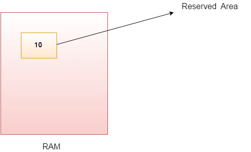

# Java Variables

A variable is a container which holds the value while the Java program is executed. A variable is assigned with a data type.

**Variable** is a name of memory location. There are three types of variables in Java: local, instance, and static.

There are two types of data types in Java: primitive and non-primitive.

### Variable

A variable is the name of a reserved area allocated in memory. In other words, it is a name of the memory location. It is a combination of "vary + able" which means its value can be changed.



```java
int data=50;//Here data is variable  
```

### Types of Variables


There are three types of variables in Java:

1. **Local Variable**

   A variable declared inside the body of the method is called a local variable. You can use this variable only within that method and the other methods in the class aren't even aware that the variable exists.

   A local variable cannot be defined with "static" keyword.

2. **Instance Variable**

   A variable declared inside the class but outside the body of the method, is called an instance variable. It is not declared as static.

   It is called an instance variable because its value is instance-specific and is not shared among instances.

3. **Static Variable**

   A variable that is declared as static is called a static variable. It cannot be local. You can create a single copy of the static variable and share it among all the instances of the class. Memory allocation for static variables happens only once when the class is loaded into memory.

### Example to Understand the Types of Variables in Java

```java
public class A {  
    static int m=100;//static variable  
    void method() {    
        int n=90;//local variable    
    }  
    public static void main(String args[]) {  
        int data=50;//instance variable    
    }  
}
```

### Java Variable Example: Add Two Numbers

```java
public class Simple {    
    public static void main(String[] args) {    
        int a=10;    
        int b=10;    
        int c=a+b;    
        System.out.println(c);    
    }  
}  
```

**Output:**  
```
20
```

### Java Variable Example: Widening

```java
public class Simple {  
    public static void main(String[] args) {  
        int a=10;  
        float f=a;  
        System.out.println(a);  
        System.out.println(f);  
    }
}
```

**Output:**  
```
10
10.0
```

### Java Variable Example: Narrowing (Typecasting)

```java
public class Simple {  
    public static void main(String[] args) {  
        float f=10.5f;  
        //int a=f;//Compile time error  
        int a=(int)f;  
        System.out.println(f);  
        System.out.println(a);  
    }
}
```

**Output:**  
```
10.5
10
```

### Java Variable Example: Overflow

```java
class Simple {  
    public static void main(String[] args) {  
        //Overflow  
        int a=130;  
        byte b=(byte)a;  
        System.out.println(a);  
        System.out.println(b);  
    }  
}
```

**Output:**  
```
130
-126
```

### Java Variable Example: Adding Lower Type

```java
class Simple {  
    public static void main(String[] args) {  
        byte a=10;  
        byte b=10;  
        //byte c=a+b;//Compile Time Error: because a+b=20 will be int  
        byte c=(byte)(a+b);  
        System.out.println(c);  
    }  
}
```

**Output:**  
```
20